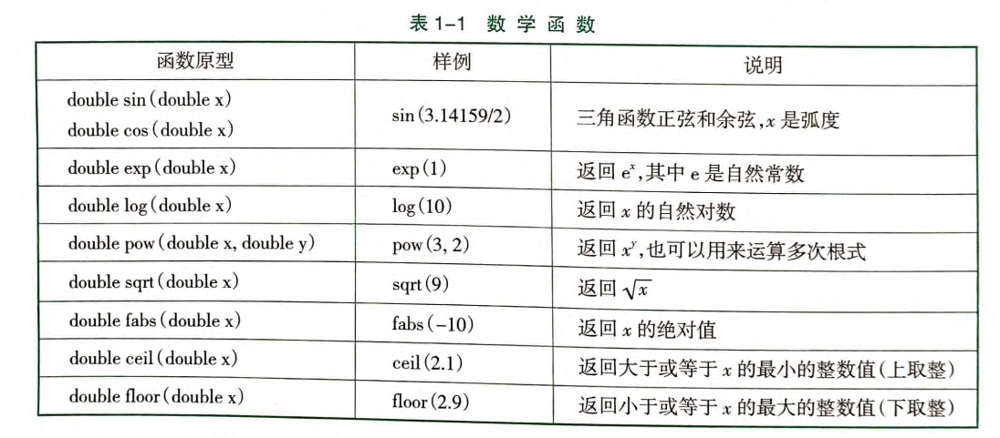
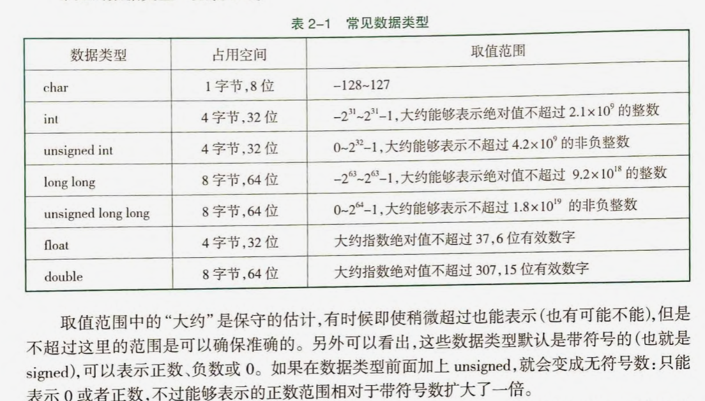
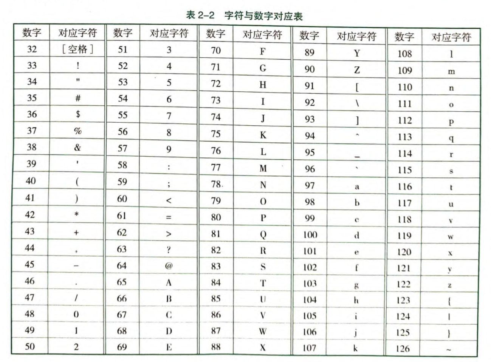
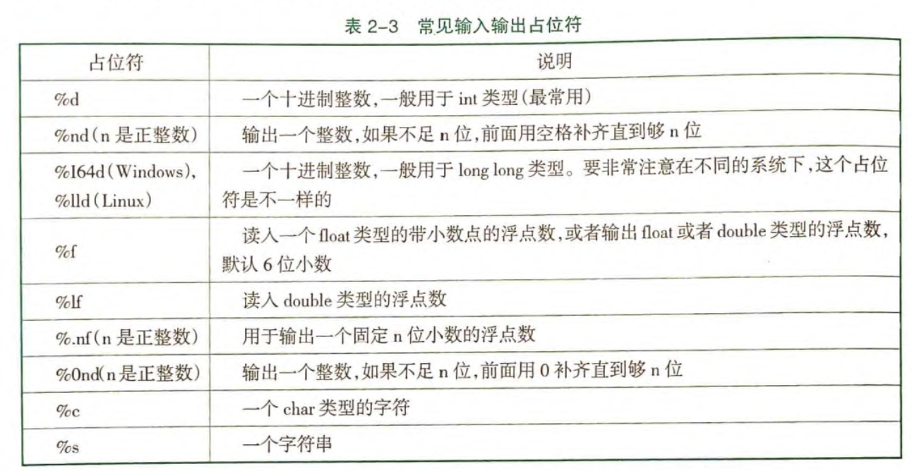

## cmath 头文件：

## 数据范围

## ASCII 码表：

## 数的问题

计算注意整数相除的舍去问题
例如：pow(2,**1.0**/2)

四舍五入：int(x+0.5)

输入类型是 int a，但是要求 long long
不能 long long ans = a*a*a\*a
a 必须也是 long long

计算有进位的差值的时候，可以先转换为最小单位，然后用 mod 和/运算

浮点数不能直接用==判断

对浮点数可以先处理为 int

## 输入输出占位符

ios::sync_with_stdio(false),cin.tie(0),cout.tie(0)

1. 关闭同步的方式，但不能使用 scanf、print 的语句
2. 不能使用 getchar()方法
3. 不能 cout<<endl; ， 用 cout<<"\n";

直接输出条件的，如果没有括号，会编译错误

scanf 可以处理符号输入
scanf("%c-%c%c%c-")

除了 11 外，所有的偶数的回文数都是 11 的倍数

memset(arr,0,sizeof(arr))包好头文件<cstring>，只能初始化为 0、-1、0x3f
将 int 转化为一个字节的二进制，然后赋值给每个字节，初始化为无穷大

二维前缀和，左上角和右下角两个坐标+1 都++，左下和右上+1 都--

getchar() 返回读入的一个字符
putchar(s) 将字符输出
while(cin>>c) 可以使用 Ctrl+Z(Windows)结束，Ctrl+D(Linux)结束
getline(cin,str) 读入一行字符串，包含空格

文件输入输出 cstdio
freopen("title.in","r",stdin)
freopen("title.out","w",stdout)

## 模拟和高精度

# 13. 二分查找与二分答案

寻找结果的单调性

```c++
// 没有重复数字
int find(int x) {
    int l = 1, r = n;
    while (l <= r) {
        int mid = (l + r) / 2;
        if (arr[mid] == x) return mid;
        else if (arr[mid] < x) l = mid + 1;
        else r = mid - 1;
    }
    return -1;
}
// 有重复数字，找到左边第一个
int find(int x) {
    int l = 1, r = n;
    while (l < r) {
        // 防止l+r越界
        int mid = l + (r - l) / 2;
        if (arr[mid] >= x) r = mid;
        else l = mid + 1;
    }
    if (arr[l] == x) return l;
    return -1;
}
// 有重复数字，找到右边第一个
int find(int x) {
    int l = 1, r = n+1;
    while (l < r) {
        // 防止l+r越界
        int mid = l + (r - l+1) / 2;
        if (arr[mid] <= x) l = mid;
        else r = mid-1;
    }
    if (arr[l] == x) return l;
    return -1;
}
```
