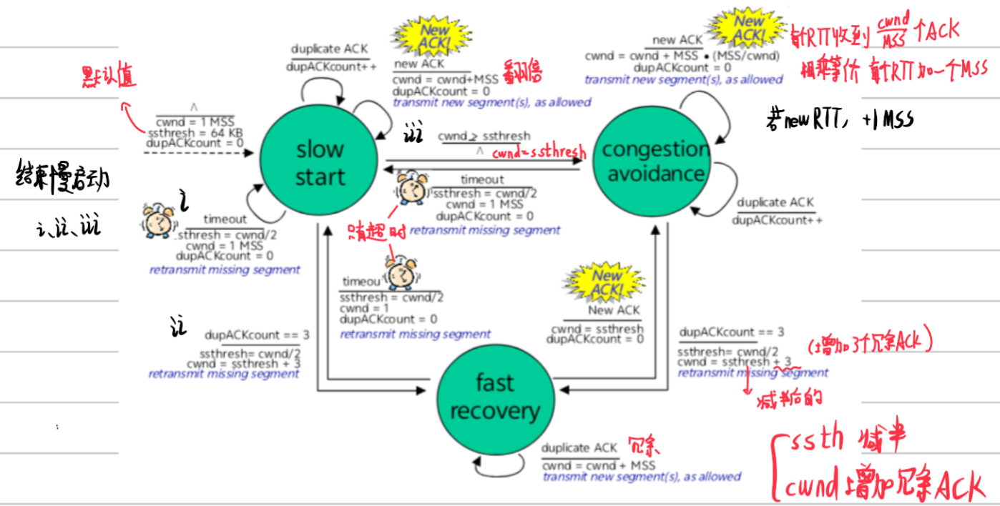

# 三、运输层

## 3.1 运输层概述

**功能：** 提供进程间的逻辑通信，好像直连一样

- 运输层协议
  - **TCP**：面向连接的可靠运输
  - **UDP**：无连接运输

## 3.2 多路复用与多路分解

|   概念   | 说明                             |
| :------: | :------------------------------- |
| 多路复用 | 发送端：从一个套接字接收多个进程 |
| 多路分解 | 接收端：发送给对应的套接字       |

- 无连接的多路分解(UDP)

  - 创建套接字，必须指定本地端口
  - 发送数据报时，指定目的 IP 和目的端口号
- 面向连接的多路分解(TCP)

  - 四元组标识：(源 IP, 源端口号, 目的 IP, 目的端口号)
  - 每个连接套接字与一个进程联系

## 3.3 UDP

### 特点

- 不提供不必要的服务
- "尽力而为"（可能丢失、乱序）
- 无连接
- **优点**：无建立连接时延、实现简单、报文段头部开销小、没有拥塞控制
- **应用**：流式多媒体、DNS、SNMP、HTTP/3

### UDP 报文段格式

```
+-------------------+-------------------+
|    源端口号       |    目的端口号      |
+-------------------+-------------------+
|      长度         |      校验和       |
+-------------------+-------------------+
|         应用数据(报文)                |
+---------------------------------------+
```

**校验和：** 将 UDP 字段视为 16bit 的 int 分段，求和，按位取反

## 3.4 可靠数据传输原理

### rdt 1.0

底层信道完全可靠，仅需正常传输

### rdt 2.0

底层信道出现比特值翻转，用检验和及 ACK/NAK：

- **ACK**：分组正确接收
- **NAK**：分组出现错误
- 发送方接收 NAK 重发，使用停等协议

### rdt 2.1

处理出错的 ACK/NAK，用序号：

- 分组添加序号字段（0/1）
- 接收方丢弃冗余分组

### rdt 2.2

无 NAK 的协议：

- 用 ACK 替代 NAK
- 用上次正确接收的分组发送 ACK

### rdt 3.0

处理比特差错和丢包：

- 设置定时器等待 ACK
- 超时重发
- 性能分析：**利用率** = 发送方用于发送的时间比例

## 3.5 流水线协议

允许发送方未得到确认，连续发送多个分组

/提高利用率 $\frac{R}{RTT + \frac{L}{R}}$

- 影响
  - 增加序号范围
  - 更大的缓存分组
  - 差错恢复：GBN、选择重传(SR)

## 3.6 回退 N 步(GBN)

- 发送方

  - 窗口内可发送 N 个分组
  - **累积确认**：ACK(n) 对 n 的都被正确接收
  - 超时重传窗口内所有分组
- 接收方

  - 发送最高序号、按序到达、已正确接收的分组的 ACK
  - 记住下一个按序接收的分组的序号
  - 乱序：丢弃

## 3.7 选择重传(SR)

- 发送方

  - 对每个正确接收的分组单独确认
  - 选择性重传：只重发未确认的分组
  - 为每个分组设置一个定时器
- 接收方

  - 对每个正确接收的分组单独发送 ACK
  - 乱序：缓存
  - 有序：交付给上层

**窗口序号问题：** 窗口为序号的一半，避免困境

## 3.8 TCP 面向连接运输

### 特点

- 点到点（不能多播）
- 可靠的、按顺序的字节流，没有报文边界
- 发送/接收缓存
- 全双工服务
- MSS：报文段中应用层数据的最大长度
- 面向连接
- 流量控制
- 拥塞控制

### TCP 报文段结构

```
+-------------------+-------------------+
|    源端口号       |    目的端口号      |
+-------------------+-------------------+
|           序号(32bit)                 |
+-------------------+-------------------+
|           确认号(32bit)               |
+-------------------+-------------------+
| 接收窗口 | 可选项 |  紧急数据指针      |
+-------------------+-------------------+
|         应用层数据                     |
+---------------------------------------+
```

- 序号与确认号
  - **序号**：报文段的应用层数据的首字节的字节流编号
  - **确认号**：期望从另一方收到的下一字节的序号（累积确认）

## 3.9 TCP 可靠数据传输

- 基于不可靠的网络层(IP)，GBN 和 SR 的混合
- 流水线、累积确认、单个重传计时器
- **快速重传：** 收到三个冗余 ACK，猜测丢包，在还没超时时进行重传

## 3.10 TCP 流量控制

TCP 流量控制：TCP 报文段字段中的接收窗口（rwnd）。若接收方读取缓存速度慢，缓存数据会被丢弃。

- 全双工，双方均维护一个接收窗口，确保缓存可用

### 接收方跟踪

$$
\begin{cases}
\text{LastByteReceived} \\
\text{LastByteRead}
\end{cases}
$$

- `LastByteReceived - LastByteRead` = 缓存中的数据
- 设置 $\text{rwnd} = \text{RcvBuffer} - (\text{LastByteReceived} - \text{LastByteRead})$，放入发送方的接收窗口字段

### 发送方跟踪

$$
\begin{cases}
\text{LastByteSent} \\
\text{LastByteAcked}
\end{cases}
$$

- 确保 `LastByteSent - LastByteAcked` < 接收窗口
- 若发送方未收到新的确认，则不更新 rwnd

### 僵持问题

- **问题**：当 B 的 rwnd 为 0 时，即使 B 逐渐读取缓存，但 B 没有发送给 A 的报文时，A 一直认为 B 的 rwnd = 0
- **解决**：当 B 的 rwnd 为 0 时，A 发送一个字节的报文，B 回应非 0 的 rwnd 的确认报文

## 3.11 TCP 连接管理

正式交换数据前，通过"握手"建立通信：双方同意连接，并同意连接变量的初始化（如序列号、初始序列号 ISN、buffer 大小等）。

### 三次握手

三次是让双方都确认"互相能看到对方"的最小次数。

|  次数  | 方向             | 动作                       | 作用                                       |
| :----: | :--------------- | :------------------------- | :----------------------------------------- |
| 第一次 | 客户端 -> 服务器 | SYN, Seq=x                 | 客户端声明要建立连接，告知自己的起始序列号 |
| 第二次 | 服务器 -> 客户端 | SYN+ACK, Seq=y, ACKnum=x+1 | 服务器确认收到，且告知自己的起始序列号     |
| 第三次 | 客户端 -> 服务器 | ACK, ACKnum=y+1            | 客户端确认收到服务器的序列号，双方同步     |

> 客户端和服务器各自独立选取 ISN（x 和 y），三次握手后双方序列号都已同步。

### 四次挥手

TCP 连接是双向的，每一方向都需要单独关闭，四次是必须的。

|  次数  | 方向             | 动作 | 作用                                                     |
| :----: | :--------------- | :--- | :------------------------------------------------------- |
| 第一次 | 客户端 -> 服务器 | FIN  | 客户端声明不再发送数据，但仍可接收                       |
| 第二次 | 服务器 -> 客户端 | ACK  | 服务器确认收到                                           |
| 第三次 | 服务器 -> 客户端 | FIN  | 服务器声明不再发送数据                                   |
| 第四次 | 客户端 -> 服务器 | ACK  | 客户端确认，服务器进入 LAST_ACK，客户端等待 2*MSL 后关闭 |

> 四次挥手天然支持半关闭（FIN 后仍可接收），TIME_WAIT 确保最后的 ACK 能到达对方。

### 流程图

```
三次握手：
客户（CLOSED）                                  服务器（LISTEN）
  |                                                |
  |--- SYNbit=1, Seq=x ------------------------->|  --> SYN_SENT
  |                                                |  --> SYN_RCVD
  |<-- SYNbit=1, Seq=y, ACKbit=1, ACKnum=x+1 --|  --> 发送 SYN/ACK
  |                                                |
  |--- ACKbit=1, ACKnum=y+1 --------------------->|  --> ESTAB
  |--> ESTAB                                       |

四次挥手：
客户（ESTAB）                                    服务器（ESTAB）
  |                                                |
  |--- FINbit=1, seq=x -------------------------->|  --> CLOSE_WAIT
  |<-- ACKbit=1, ACKnum=x+1 ----------------------|  --> FIN_WAIT_1
  |                                                |
  |<-- FINbit=1, seq=y ---------------------------|  --> 服务器发完数据后
  |--- ACKbit=1, ACKnum=y+1 --------------------->|  --> LAST_ACK
  |                                                |
  |         TIME_WAIT（等 2*MSL）                  |
```

> **备注**：握手后首部 + 数据都是序列号字节流，SYN 消耗一个序列号，使数据流无缝衔接。仍存在"僵持"现象，但实际网络中概率极低，可接受。

## 3.12 拥塞控制原理

- 与流量控制的区别

  - 流量控制：接收方缓存满
  - 拥塞控制：网络中缓存满
- 拥塞代价

  - 接近链路容量时，时延增大
  - 丢包/重传降低有效吞吐量
  - 不必要的重传降低有效吞吐量
  - 上游链路容量浪费在下游丢弃的分组上
- 控制方法

  - **端到端拥塞控制**：没有网络层反馈，根据丢包和时延推断（TCP 采用）
  - **网络辅助**：路由器发送阻塞分组或标记分组字段

## 3.13 TCP 拥塞控制

### AIMD(加性增、乘性减)

- 加性增：每个 RTT 内线性增加 1 MSS
- 乘性减：遇到丢包时减半

### 四个阶段

- 丢包事件

  - **三个重复 ACK**：减半
  - **超时**：减至 1 MSS
- 慢启动

  - cwnd 指数式增加直至丢包
  - 超过 ssthresh 进入拥塞避免
- 拥塞避免

  - 线性增加 cwnd
- 快速恢复

  - 收到三个冗余 ACK 后进入


