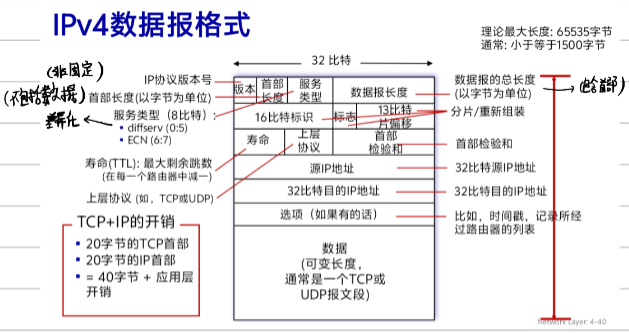
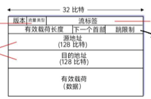

# 四、网络层：数据平面

## 4.1 网络层概述

- 功能

  - **转发**：将分组从路由器输入移到输出（局部动作）
  - **路由选择**：确定从源主机到目的主机的路径（全局动作）
- 网络层

  - 数据平面： 本地，转发（硬件）
  - 控制平面： 网络范围，路由
    - **传统路由选择算法**：路由器内实现
    - **SDN**：远程控制器实现

## 4.2 网络服务模型

| 网络架构          |  服务类型  |   带宽   |   丢弃   | 时延 | 时延抖动 |
| :---------------- | :--------: | :------: | :-------: | :--: | :------: |
| Internet          |  尽力而为  |    无    |    有    |  无  |    无    |
| ATM CBR           | 恒定比特率 |  恒定率  |    有    |  有  |    有    |
| ATM ABR           | 可用比特率 | 最小保证 |    有    |  有  |    无    |
| Internet IntServ  |   有保障   |    有    |    有    |  有  |    有    |
| Internet DiffServ | 可区分服务 |   可能   | 300 bit/s | 可能 |    无    |

**Internet 尽力而为服务：** 不保证数据报成功交付、有序交付、端到端时延、最小带宽

## 4.3 路由器

- **输入输出端口**：进行查找，分布式转发，缓存
  - 转发
    - 目的地转发：仅用IP转发
    - 通用转发：基于首部字段的任意集合转发
  - 排队
    - **输入排队**：交换速率 < 输入速率导致丢包
    - **输出排队**：多个输入到同一输出导致 HOL 阻塞
  - **缓存设置**：RTT × C
    - 分组调度
      - FIFO：先来先服务
      - 优先权排队：高优先级先服务
      - 循环排队：不同类型轮流执行
      - 加权公平排队(WFQ)：每类保证最小带宽
- **交换结构**：分组从输入到输出
  - 内存 ： CPU 控制，内存带宽受限，同时只能处理一个 I/O
  - 总线 ： 竞争，同时只能处理一个 I/O
  - 纵横式 ： 非阻塞，不同输出可同时处理多个 I/O
- **路由选择处理器**：控制平面软件

## 4.4 网际协议(IP)

### IPv4 数据报格式

- 分片与重组

  - **MTU**：链路层最大传输单元
  - 大数据报分片，只在目的主机重组
  - 标识、标志、片偏移字段用于分片管理
- IP 编址

  - **IP 地址**：32 位，与物理接口相关联
  - **子网**：物理直连，中间不用经过路由器

**IDR（无类别域间路由选择）：** 采用 a.b.c.d/x 格式表示网络前缀，其中 x 为掩码。

### DHCP

动态主机配置协议：

1. 主机广播 DHCP 发现报文
2. DHCP 服务器响应
3. 主机请求 IP 地址
4. DHCP 服务器发送 ACK

### NAT

网络地址转换：

- 本地网络共享一个 IP 地址
- 转换表记录 (IP, 端口) 对
- 专用地址空间：10/8, 172.16/12, 192.168/16

## 4.5 IPv6

### 特点

- 128 位地址
- 定长 40 字节头部
- 没有分片/重新组装
- 没有首部检验和
- 没有选项

### IPv6 数据报格式

### IPv4 与 IPv6 共存

- **隧道**：在 IPv4 之间传播时，将 IPv6 封装到 IPv4

## 4.6 通用转发与 SDN

### SDN 架构

- **核心思想**：控制平面（路由器选择功能）与数据平面（转发功能）分离
- **远程控制器**：在服务器上实现路由选择软件，通过南向接口（如 OpenFlow）与交换机通信
- **优势**：集中式管理、灵活性高、 programmable（可编程）

### OpenFlow 流表

**匹配 + 动作** 范式：流表项 = 匹配字段 + 计数器 + 动作

**流表项结构**

| 字段   | 说明                   |
| :----- | :--------------------- |
| 优先级 | 匹配优先级             |
| 计数器 | 已匹配分组数、字节数等 |
| 超时   | 剩余生存时间           |
| 指令   | 要执行的动作           |

- 匹配字段

  - 入端口
  - 源/目的 MAC 地址
  - Ethertype
  - VLAN ID
  - IP 源/目的地址
  - 协议号
  - TCP/UDP 源/目的端口
  - DSCP、ECN 等
- 动作类型

  - **转发到端口**：一个或多个端口
  - **丢弃**：无动作即丢弃
  - **修改头部字段**：NAT 转换、修改 TTL 等
  - **发送给控制器**：packet-in 消息
  - **修改 VLAN**：添加/移除 VLAN 标签

### OpenFlow 流程

1. 分组到达交换机，查找流表
2. 匹配成功 → 执行动作，更新计数器
3. 匹配失败 → 发送到控制器（packet-in）
4. 控制器决定策略，发送 flow-mod 消息安装流表项

### 中间盒

**中间盒：** 源主机到目的主机数据路径上，执行除 IP 路由器的正常标准功能的网络设备

- 中间盒类型
  - NAT（网络地址转换）
  - 防火墙
  - 负载均衡器
  - IDS/IPS（入侵检测/防御）
  - CDN 缓存
