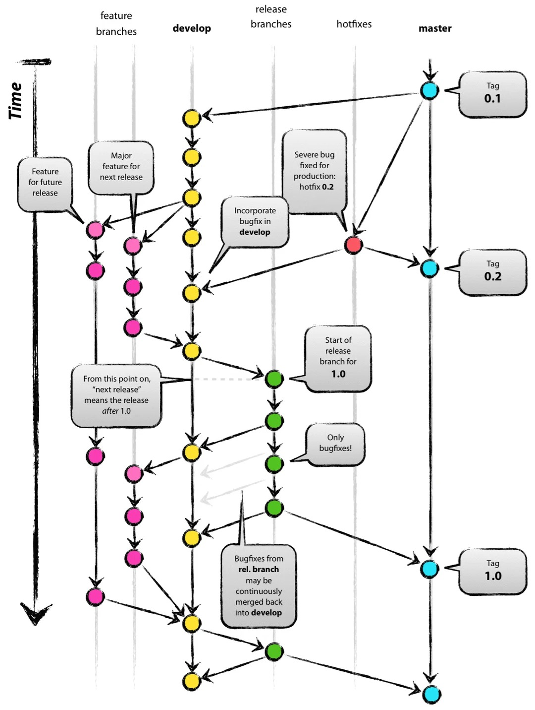

# git

# 一、初始化与配置

## 配置用户信息

```bash
# 设置全局用户名和邮箱
git config --global user.name "Your Name"
git config --global user.email "your@email.com"

# 设置当前仓库的局部配置（覆盖全局）
git config user.name "Your Name"
```

## 查看配置

```bash
# 查看所有配置
git config --list

# 查看某个配置项
git config user.name
```

# 二、基本操作

## 数据流动

- **工作区**：你直接编辑文件的目录。
- **缓存区**：提交前的中间状态，存放已暂存的文件。
- **本地仓库**：保存已提交的历史版本。
- **远程仓库**：托管在服务器上，用于协作和备份。

## 本地命令

### git init

**初始化仓库**，在当前目录创建一个新的 Git 仓库。

```bash
# 在当前目录初始化 Git 仓库
git init
git init -b main
```

### git status

**查看状态**，显示工作区和暂存区的文件变更情况。

```bash
# 查看工作区和暂存区的状态
git status
git status -s
```

### git add

**添加到暂存区**，将工作区的修改放入暂存区，准备提交。

```bash
# 添加单个文件到暂存区
git add filename.txt

# 添加所有文件（新文件、修改、删除）
git add .
```

### git commit

**提交版本**，将暂存区的变更保存到本地仓库。

```bash
# 提交暂存区的变更
git commit -m "提交信息"

# 修改上一次提交信息
git commit --amend -m "新的提交信息"

# 补文件到上一次提交
git add forgotten-file.txt
git commit --amend --no-edit
```

### git mv

**移动/重命名文件**，将文件移动到新位置或重命名，Git 会自动检测为重命名操作（而不是删除+新增）。

```bash
# 重命名文件
git mv old-name.txt new-name.txt

# 移动文件到其他目录（保留原文件名）
git mv old-name.txt new-dir/
```

### git diff

**查看差异**，比较工作区、暂存区、提交之间的文件改动。

```bash
# 查看工作区与暂存区的差异
git diff

# 查看暂存区与上次提交的差异
git diff --staged
```

### git log

**查看历史**，浏览提交记录和分支历史。

```bash
# 查看提交历史（简洁格式）
git log --oneline

# 以图形方式查看分支历史
git log --graph --oneline --all
```

### git reset

**永久撤销（修改历史）**，主要用于"回到过去并重来"，会删除提交记录。

```bash
# 撤销暂存（文件回到工作区，保留修改）
git reset HEAD filename.txt

# 撤回上次提交，保留修改到工作区
git reset HEAD~1

# 撤回上次提交，保留修改到暂存区
git reset --soft HEAD~1

# 撤回上次提交，并丢弃所有修改（慎用！）
git reset --hard HEAD~1

# 回到更早的指定提交，保留之后的修改在工作区
git reset commit-hash

# 回到更早的指定提交，丢弃之后的修改（慎用！）
git reset --hard commit-hash

# 回到其他分支的指定提交
git reset <branch-name>~2
```

### git checkout

**分支临时查看（只读模式）**，主要用于"看看过去的样子"，不影响当前分支。

```bash
# 切换分支
git checkout branch-name

# 创建并切换到新分支（基于当前分支）
git checkout -b branch-name

# 创建并切换到新分支（基于指定分支/提交）
git checkout -b feature/login develop

# 切换到某个历史提交查看（只读）
git checkout commit-hash
```

### git branch

**分支管理**，查看、创建、重命名、删除分支。

```bash
# 列出所有本地分支
git branch

# 创建新分支
git branch branch-name

# 重命名当前所在分支
git branch -m main

# 重命名指定分支（当前不在该分支上时）
git branch -m master main

# 删除本地分支
git branch -d branch-name

# 查看所有分支（本地 + 远程）
git branch -a
```

### git merge

**合并分支**，将另一个分支的变更合并到当前分支。

```bash
# 合并指定分支到当前分支
# 直接用指定分支的最后一个提交作为当前分支的提交
git merge branch-name

# 创建合并提交
# 创建一个新的合并提交（推荐）
git merge --no-ff branch-name

# 以压缩方式合并（将另一分支的所有提交压缩成一个）
git merge --squash branch-name

# 中止合并（解决冲突时放弃合并）
git merge --abort
```

### git rebase

**变基**，将当前分支的提交重新应用到目标分支之上，使历史更线性。

```bash
# 将当前分支的提交变基到目标分支上
git rebase branch-name

# 交互式变基，编辑最近的 N 个提交（可合并、修改、删除提交）
git rebase -i HEAD~N
```

### git tag

**版本标签**，给某个提交打上固定的版本标记。

```bash
# 创建附注标签
git tag -a v1.0.0 -m "v1.0.0 正式版"

# 查看所有标签
git tag
```

## 远程命令

### git clone

**克隆仓库**，将远程仓库完整复制到本地。

```bash
# 克隆远程仓库到本地
git clone https://github.com/user/repo.git
```

### git remote

**远程管理**，查看和管理远程仓库地址。

```bash
# 查看远程仓库地址
git remote -v

# 添加远程仓库
git remote add origin https://github.com/user/repo.git
```

### git push

**推送到远程**，将本地提交上传到远程仓库。

```bash
# 推送本地分支到远程
# 首次推送需设置上游
git push -u origin branch-name

# 后续直接推送即可
git push origin branch-name
```

### git pull

**拉取并合并**，从远程抓取变更并合并到当前分支。

```bash
# 拉取远程变更并合并
git pull

# 拉取并使用 rebase 合并
git pull --rebase
```

### git fetch

**抓取远程**，从远程获取最新变更但不自动合并。

```bash
# 仅抓取远程变更，不自动合并
git fetch
```

# 三、Git Flow 工作流



**Git Flow** 是一种经典的分支管理策略，通过五种分支来组织开发流程，让多人协作更有序。

## 分支类型与生命周期

| 分支类型                | 命名规则                  | 来源               | 合并到                 | 存活周期           |
| ----------------------- | ------------------------- | ------------------ | ---------------------- | ------------------ |
| **`main`**      | `main`（或 `master`） | —                 | —                     | 永久存在           |
| **`develop`**   | `develop`               | 从`main` 创建    | `main`               | 永久存在           |
| **`feature/*`** | `feature/xxx`           | 从`develop` 创建 | `develop`            | 功能开发完成后删除 |
| **`release/*`** | `release/x.x.x`         | 从`develop` 创建 | `develop` + `main` | 发布完成后删除     |
| **`hotfix/*`**  | `hotfix/x.x.x`          | 从`main` 创建    | `develop` + `main` | 修复完成后删除     |

---

## 各分支详细说明

### 1. `main` — 生产分支（主分支）

- **存放随时可部署到生产环境的代码**
- 每次合并到 `main` 都意味着一次正式发布，通常打上版本标签（`tag`）
- 
- **禁止直接在 `main` 上开发**，只能通过 `release` 或 `hotfix` 分支合并进来
- 保护规则：通常设置 PR 审核 + 禁止直接推送

### 2. `develop` — 开发主分支

- **日常开发的总集散地**，包含下一个版本的所有功能
- 所有 `feature` 分支开发完成后合并回 `develop`
- 代码相对稳定，但可以包含未发布的功能
- 当 `develop` 累积的功能足够发布一个版本时，从中创建 `release` 分支

### 3. `feature/*` — 功能分支

- **用于开发一个独立的功能模块**
- 命名示例：`feature/login`、`feature/payment`、`feature/user-profile`
- 从 `develop` 分支创建，开发完成后合并回 `develop`
- 一个 `feature` 分支只做一个功能，多人协作时互不干扰
- 开发周期：短则几小时，长则数天

```bash
# 基于deve创建功能分支
git checkout -b feature/login develop

# 在 feature/login 上开发...

# 开发完成后合并回 develop
git checkout develop
git merge --no-ff feature/login

# 删除功能分支（可选）
git branch -d feature/login
```

### 4. `release/*` — 发布分支

- **用于准备一次正式发布**，做最后的测试、Bug 修复、版本号更新
- 命名示例：`release/1.2.0`、`release/2.0.0`
- 从 `develop` 创建，此时 `develop` 已经包含了本次发布的所有功能
- **在这个分支上：**
  - 只修 Bug，不添加新功能
  - 更新版本号、CHANGELOG
  - 进行回归测试
- 完成后同时合并到 `main` 和 `develop`，确保两边都不遗漏修复

```bash
# 创建发布分支
git checkout -b release/1.2.0 develop

# 在 release/1.2.0 上修 Bug、更新版本号...

# 发布完成后，合并到 main
git checkout main
git merge --no-ff release/1.2.0
git tag -a v1.2.0 -m "v1.2.0 正式版"

# 也要合并回 develop（确保修复不会丢失）
git checkout develop
git merge --no-ff release/1.2.0

# 删除发布分支
git branch -d release/1.2.0
```

### 5. `hotfix/*` — 热修复分支

- **用于紧急修复生产环境的问题**（线上 Bug、安全漏洞等）
- 命名示例：`hotfix/1.2.1`、`hotfix/critical-security-fix`
- **从 `main` 创建**（因为线上出问题的是 `main` 的代码）
- **唯一从 `main` 拉出来的分支**
- 修复完成后同时合并到 `main` 和 `develop`（或当前的 `release` 分支）
- 优先级最高，可以打断正在进行的开发工作

```bash
# 从 main 创建紧急修复分支
git checkout -b hotfix/1.2.1 main

# 修复 Bug...

# 修复完成后合并到 main
git checkout main
git merge --no-ff hotfix/1.2.1
git tag -a v1.2.1 -m "v1.2.1 紧急修复"

# 也要合并回 develop
git checkout develop
git merge --no-ff hotfix/1.2.1

# 删除热修复分支
git branch -d hotfix/1.2.1
```

# 四、vscode 中的 git 状态

VSCode 文件资源管理器中，文件名旁会显示状态标识：

|     标识     |  颜色  | 含义                          | 常见场景                           |
| :----------: | :-----: | ----------------------------- | ---------------------------------- |
| **M** | 🟡 黄色 | 已修改，未添加到暂存区        | 编辑文件后，还没`git add`        |
| **U** | 🔵 蓝色 | 新文件，未被 Git 跟踪         | 创建了新文件                       |
| **A** | 🟢 绿色 | 已添加到暂存区，未提交        | 已`git add`，还没 `git commit` |
| **D** | 🔴 红色 | 已删除，未提交                | 删除了文件                         |
| **R** | 🟢 绿色 | 已重命名，未提交              | 重命名了文件                       |
| **?** | 🔵 蓝色 | 未跟踪且不在`.gitignore` 中 | 新文件                             |
| **\!** | ⚪ 灰色 | 被`.gitignore` 忽略         | 配置过忽略的文件                   |

## 颜色速记

|  颜色  | 含义            | 对应状态 |
| :-----: | --------------- | -------- |
| 🟡 黄色 | 已修改但未暂存  | M, T     |
| 🔵 蓝色 | 未跟踪 / 新文件 | U, ?     |
| 🟢 绿色 | 已暂存          | A, R, C  |
| 🔴 红色 | 已删除          | D        |
| ⚪ 灰色 | 被忽略          | !        |
