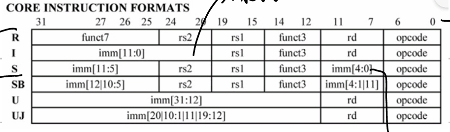

# 三、RISC-V 指令系统

## CISC vs RISC

| 比较维度       | CISC                 | RISC                                              | 后RISC       |
| -------------- | -------------------- | ------------------------------------------------- | ------------ |
| 指令数目       | 几百个               | < 100                                             | 几百个       |
| 寻址方式       | 复杂                 | 简单                                              | 简单         |
| 指令周期       | 变化很大             | 大部分单周期                                      | 大部分单周期 |
| 指令长度       | 变长                 | 定长                                              | 简单变长     |
| 程序所需指令数 | 少                   | 多                                                | 多           |
| 寄存器数目     | 少                   | 多                                                | 多           |
| 利于流水线     | 不利于               | 利于                                              | 利于         |
| 示例           | x86, MC68000, PDP-11 | LoongArch, ARM, RISC-V, Alpha, MIPS, Sparc, Power |              |

## 指令格式（6 种）

所有指令固定 32 位，opcode 占 7 位，funct3/funct7 为附加操作码，imm 均为补码符号扩展。

- **R 型**：寄存器-寄存器运算，两个源寄存器 rs1、rs2，结果写入 rd，由 funct7+funct3 确定具体操作
- **I 型**：立即数运算或 Load，rs1 为基址寄存器，rd 为目标寄存器，imm[11:0] 为 12 位有符号立即数
- **S 型**：Store 指令，rs2 为数据源，rs1 为基址，imm 分两段拼接（高 7 位在 opcode 前，低 5 位在 rd 前）
- **SB 型**：条件分支，rs1、rs2 为比较寄存器，imm 分散拼接（高 7 位在 opcode 前，低 5 位在 rd 前），第 0 位默认 0，实际跳转偏移 = imm × 2
- **U 型**：高位立即数指令，imm[31:12] 加载到 rd 高 20 位，低 12 位清零，用于构造大立即数
- **UJ 型**：无条件跳转，imm 分散拼接，目标地址 = PC + (imm × 2)，rd 保存返回地址

## 六类指令

### 1. 算术运算

| 指令 | 示例                | 含义             |
| ---- | ------------------- | ---------------- |
| add  | `add x5, x6, x7`  | `x5 = x6 + x7` |
| sub  | `sub x5, x6, x7`  | `x5 = x6 - x7` |
| addi | `addi x5, x6, 20` | `x5 = x6 + 20` |

> RISC-V 没有 subi，用 addi 加负数代替。

### 2. 数据传输（Load/Store）

| 指令     | 示例              | 含义                      |
| -------- | ----------------- | ------------------------- |
| lw       | `lw x5, 40(x6)` | `x5 = Memory[x6+40]`    |
| sw       | `sw x5, 40(x6)` | `Memory[x6+40] = x5`    |
| lb / lbu | `lb x5, 40(x6)` | 取字节（符号/无符号扩展） |
| sb       | `sb x5, 40(x6)` | 存字节                    |

> 内存按字节编址；lw/sw 地址必须 4 字节对齐。

### 3. 逻辑运算

| 指令       | 示例               | 含义             |
| ---------- | ------------------ | ---------------- |
| and / andi | `and x5, x6, x7` | `x5 = x6 & x7` |
| or / ori   | `or x5, x6, x8`  | `x5 = x6 \| x8` |
| xor / xori | `xor x5, x6, x9` | `x5 = x6 ^ x9` |

> 非：xori x5, x5, -1

### 4. 移位操作

| 指令       | 示例               | 含义                   |
| ---------- | ------------------ | ---------------------- |
| sll / slli | `sll x5, x6, x7` | 逻辑左移               |
| srl / srli | `srl x5, x6, 3`  | 逻辑右移               |
| sra / srai | `sra x5, x6, 3`  | 算术右移（符号位扩展） |

> 逻辑移位：空位补 0；算术移位：符号位填充，保持符号不变。

#### 移位与除法的舍入

除以 2 与右移一位的区别：

- $n \ge 0$：一样
- $n$ 负且偶数：一样
- $n$ 负且奇数：不一样（正数向 0 靠，负数向 $-\infty$ 靠）

C语言与 Python 的区别：

| 操作               | C                  | Python                     |
| ------------------ | ------------------ | -------------------------- |
| 右移               | 向下舍入           | 向下舍入                   |
| int / float → int | 向零舍入           | 向零舍入                   |
| 除法`/`          | 整数运算时向零舍入 | 真除法（结果为浮点数）     |
| 整除`//`         | —                 | 向下舍入，`(-5)//2 = -3` |

> 当 $k$ 超过机器字长位数时，C 语言未规定（由实现决定），Java 要求取模 $k \bmod w$。

### 5. 条件分支

| 指令       | 示例                | 条件                      |
| ---------- | ------------------- | ------------------------- |
| beq        | `beq x5, x6, 100` | 相等跳转                  |
| bne        | `bne x5, x6, 100` | 不等跳转                  |
| blt / bltu | `blt x5, x6, 100` | 小于（有符号/无符号）跳转 |
| bge / bgeu | `bge x5, x6, 100` | 大于等于跳转              |

> 没有 `>`、`<=`（用交换操作数位置实现）；分支地址 = PC + imm×2（imm 默认第 0 位为 0）。

### 6. 无条件跳转

| 指令 | 示例               | 含义                                             |
| ---- | ------------------ | ------------------------------------------------ |
| jal  | `jal x1, 100`    | `x1 = PC+4; PC = PC+100`（保存返回地址并跳转） |
| jalr | `jalr x0, 0(x1)` | 跳转到 x1 指向的地址（用于返回）                 |

> jal 保存下条指令地址到 rd；`jal x0, Label` 为直接跳转（忽略返回地址）。

## 立即数

- addi 用于加载常数（避免 load 指令）
- lui：取立即数高位（高 20 位），低 12 位用 addi 填充
- li 伪指令：lui + addi 实现任意 32 位立即数

## 寻址方式

| 方式          | 说明                            |
| ------------- | ------------------------------- |
| 立即数寻址    | 操作数是指令本身的常量          |
| 寄存器寻址    | 操作数在寄存器中                |
| 基址/偏移寻址 | 操作数在内存中（寄存器 + 偏移） |
| PC 相对寻址   | 地址是 PC + 常量（分支、跳转）  |
