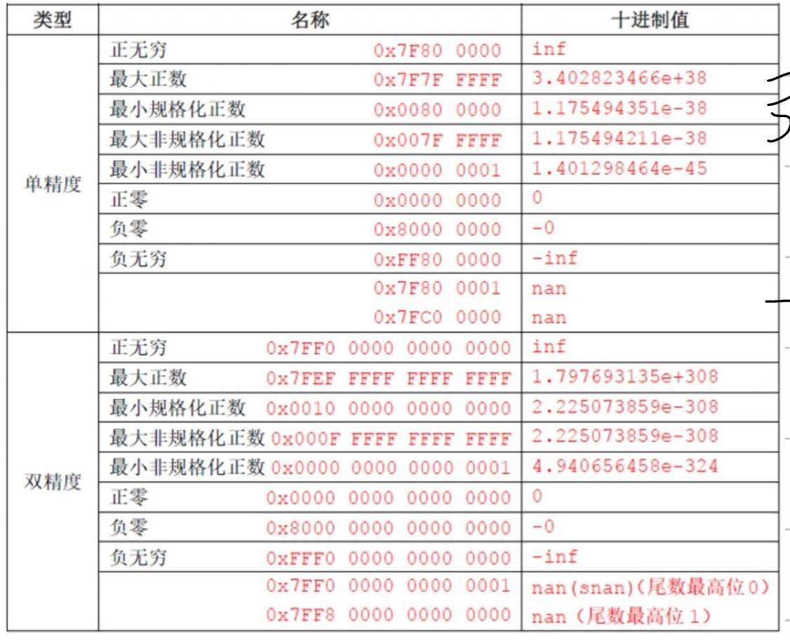
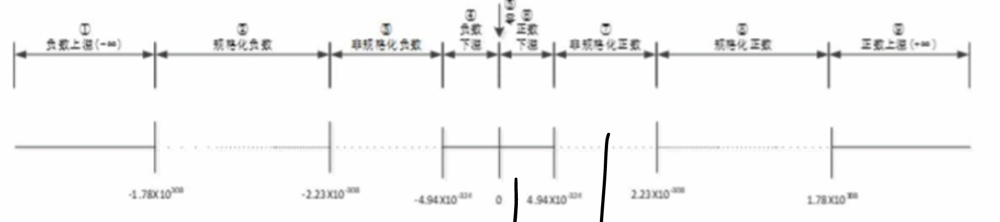

# 六、浮点数

计算机本质：有限精度数，固定位数

## IEEE 754 格式

| 格式             | 总位数 | 符号 | 阶码 | 尾数 | 偏移量 | 范围             |
| ---------------- | :----: | :--: | :--: | :--: | :----: | ---------------- |
| **半精度** |   16   |  1  |  5  |  10  |   15   | —               |
| **单精度** |   32   |  1  |  8  |  23  |  127  | $10^{\pm 38}$  |
| **双精度** |   64   |  1  |  11  |  52  |  1023  | $10^{\pm 308}$ |

## 数值解码边界

以单精度（32位）为例：符号1位 + 阶码8位 + 尾数23位，偏移量127。

| 类型                 |  阶码  | 尾数 | 最小值                                    | 最大值                                                       | 尾数说明                        |
| -------------------- | :----: | :--- | ----------------------------------------- | ------------------------------------------------------------ | ------------------------------- |
| **规格化数**   | 01–FE | f≠0 | $2^{-126} \approx 1.18 \times 10^{-38}$ | $2^{127} \times (2-2^{-23}) \approx 3.4 \times 10^{38}$    | 隐含`1.`，实际 $1.f$        |
| **非规格化数** |   00   | f≠0 | $2^{-149} \approx 7.0 \times 10^{-45}$  | $2^{-126} \times (1-2^{-23}) \approx 1.18 \times 10^{-38}$ | 隐含`0.`，实际 $0.f$        |
| **特殊值**     |   FF   | 00   | —                                        | —                                                           | 阶码全1表示 ∞；尾数非0表示 NaN |

> 非规格化数起过渡作用，填补了规格化数最小值与零之间的间隙。
> 阶码采用 **偏移量** 编码：实际指数 = 存储的阶码 − 偏移量（单精度偏移 127，双精度偏移 1023），阶码全 1 表示特殊值（∞ 或 NaN），全 0 表示非规格化数。

## 溢出

## 舍入方式

| 方式                       | 说明                       |
| -------------------------- | -------------------------- |
| **向零舍入**         | 正负数都截断，易累积误差   |
| **向上舍入**         | 正数进 1，负数截断         |
| **向下舍入**         | 正数截断，负数进 1         |
| **就近舍入（偶数）** | 四舍五入，0.5 时向偶数位舍 |

> 就近舍入（偶数）是 IEEE 754 默认方式，误差最小且最均匀；向零舍入误差偏向零点，向上/向下舍入分别产生正/负偏差。

## 浮点运算步骤

### 加法/减法

1. 对阶（小阶向大阶看齐）
2. 有效数字相加/减
3. 规格化，同时检查溢出
4. 舍入

### 乘法/除法

1. 指数相加/减
2. 有效数相乘/除
3. 规格化，检查溢出
4. 舍入
5. 确定符号位

## 浮点运算定律

> 浮点加法**不满足结合律**（大数加小数可能忽略小数）

> 浮点乘法对整数乘法**不满足分配律**

## RISC-V 浮点指令

| 操作   | 单精度          | 双精度  |
| ------ | --------------- | ------- |
| 加     | fadd.s          | fadd.d  |
| 减     | fsub.s          | fsub.d  |
| 乘     | fmul.s          | fmul.d  |
| 除     | fdiv.s          | fdiv.d  |
| 平方根 | fsqrt.s         | fsqrt.d |
| 比较   | feq / flt / fle | 同上    |

浮点寄存器：f0-f31（32 个）
